<p align="center">
  
</p>

<p align="center">
  <a href="https://pypi.org/project/pyehicle/"></a>
  <a href="https://pypi.org/project/pyehicle/"></a>
  <a href="https://pyehicle.readthedocs.io/"></a>
  <a href="https://www.python.org/downloads/"></a>
  <a href="https://opensource.org/licenses/MIT"></a>
  <a href="https://github.com/Nick-Doulos/pyehicle"></a>
</p>

**Pyehicle** is a Python library for GPS trajectory processing, map-matching, and reconstruction. It transforms noisy, fragmented GPS data into accurate, road-network-aligned trajectories using state-of-the-art algorithms including HMM map-matching, Kalman filtering with EM parameter learning, and intelligent trajectory reconstruction. Built with performance in mind, Pyehicle supports offline processing, handles large-scale trajectories through chunked processing, and provides research-grade evaluation metrics for trajectory quality assessment.

## Table of Contents

- [Table of Contents](#table-of-contents)
- [Key Features](#key-features)
- [Installation](#installation)
  - [From Source](#from-source)
- [Quick Start](#quick-start)
- [Data Format](#data-format)
- [API Reference](#api-reference)
  - [Preprocessing Module](#preprocessing-module)
    - [Compression](#compression)
    - [Map-Matching](#map-matching)
    - [Kalman Filtering](#kalman-filtering)
    - [Segmentation](#segmentation)
    - [Interpolation](#interpolation)
    - [Sampling Rate Analysis](#sampling-rate-analysis)
  - [Reconstructing Module](#reconstructing-module)
    - [Trajectory Combiner](#trajectory-combiner)
    - [Trajectory Refinement](#trajectory-refinement)
    - [Curve Interpolation](#curve-interpolation)
  - [Utilities Module](#utilities-module)
    - [Road Network Loading](#road-network-loading)
    - [Evaluation Metrics](#evaluation-metrics)
    - [Visualization](#visualization)
- [Advanced Usage](#advanced-usage)
  - [Custom AEQD Projection Precision](#custom-aeqd-projection-precision)
  - [Chunked Processing for Large Trajectories](#chunked-processing-for-large-trajectories)
  - [Caching Overpass Data](#caching-overpass-data)
- [Algorithm Details](#algorithm-details)
  - [Map-Matching](#map-matching-1)
  - [Kalman Filtering](#kalman-filtering-1)
  - [Trajectory Reconstruction](#trajectory-reconstruction)
  - [Evaluation Metrics](#evaluation-metrics-1)
- [Dependencies](#dependencies)
  - [Core Requirements](#core-requirements)
- [Contributing](#contributing)
- [License](#license)
- [Citation](#citation)
- [Acknowledgments](#acknowledgments)
- [Development](#development)
  - [Building from Source](#building-from-source)
- [Support](#support)

## Key Features

- 🛣️ **Smart Trajectory Reconstruction**: Automatically combines topologically equivalent trajectories, detects and interpolates road curves, and enforces road network continuity at intersections to produce accurate, refined trajectories
- 🗺️ **OpenStreetMap Integration**: Seamless integration with OSM data via iGraph for fast graph operations, R-tree spatial indexing, and BallTree/KDTree nearest-neighbor queries
- 🔄 **Dual Map-Matching Engines**: Choose between Leuven's HMM-based matcher or Valhalla's Meili service (via Docker - [setup guide](https://nickdoulos.com/posts/map-matching/))
- 📊 **Research-Grade Evaluation**: Built-in RMF, Precision, Recall, and F1 metrics with Overpass API integration for ground-truth road network comparison
- ⚡ **Performance Optimized**: Supports both Pandas and Polars DataFrames with Numba JIT compilation for computational hotspots
- 🌐 **Fully Offline Capable**: Works completely offline - use Leuven with downloaded PBF files, or run Valhalla/Meili in Docker locally

## Installation

```bash
pip install pyehicle
```

### From Source

```bash
git clone https://github.com/Nick-Doulos/pyehicle.git
cd pyehicle
pip install -e .
```

## Quick Start

```python
import pandas as pd
import pyehicle as pye

# 1. Load GPS trajectory data
df = pd.read_csv('trajectory.csv')  # Columns: lat, lon, time

# 2. Preprocessing: Map-match
matched = pye.preprocessing.meili(
    compressed,
    lat_col='lat',
    lon_col='lon',
    time_col='time'
)

# 3. Load road network (with caching for faster subsequent loads)
road_network, geometries, spatial_index = pye.utilities.load_road_network(
    pbf_file_path='map.osm.pbf',
    bbox=(56.9, 57.0, 24.0, 24.2),  # (north, south, east, west)
    save_path='network_cache.graphml'
)

# 4. Reconstruction: Produce the final refined trajectory
refined = pye.reconstructing.refine_trajectory(
    filtered,
    road_network,
    max_node_distance=10,
    time_col='time'
)
refined = pye.reconstructing.curve_interpolation(
    refined,
    road_network,
    max_node_distance=10,
    lower_threshold=20,
    upper_threshold=80,
    time_col='time'
)

# 5. Optional Post-processing: Compress and filter the trajectory
filtered = pye.preprocessing.kalman_aeqd_filter(
    refined,
    lat_col='lat',
    lon_col='lon',
    time_col='time'
)
final_trajectory = pye.preprocessing.spatio_temporal_compress(
    filtered,
    spatial_radius_km=0.01,
    time_threshold_s=30
)

# 6. Visualize and save the refined trajectory
pye.utilities.visualization.single(
    final_trajectory,
    name='Reconstructed Trajectory',
    show_in_browser=True
)
final_trajectory.to_csv('reconstructed_trajectory.csv', index=False)
```

**Pipeline Overview:**

```mermaid
graph LR
    A["<b>Raw GPS Data</b><br/><i>(Noisy, Inaccurate)</i>"] --> B["<b>Preprocessing</b><br/><i>(Map-Matching)</i>"]
    B --> C["<b>Reconstruction</b><br/><i>(Combine, Refine,<br/>Curve Interp)</i>"]
    
    %% New Optional Box inserted here
    C --> OP["<b>Optional Post-processing</b><br/><i>(Compress, Kalman Filter,<br/>etc.)</i>"]
    OP --> D["<b>Final Trajectory</b><br/><i>(Accurate,<br/>Road-aligned)</i>"]
    
    %% 1. Style the Connecting Lines
    linkStyle default stroke:#a9a9a9,stroke-width:2px;

    %% 2. Define Custom Classes
    classDef rawNode fill:#2d2d2d,stroke:#9e9e9e,stroke-width:2px,color:#fff;
    classDef procNode fill:#2e2030,stroke:#9575cd,stroke-width:2px,color:#fff;
    classDef finalNode fill:#102027,stroke:#29b6f6,stroke-width:2px,color:#fff;
    
    %% 3. New Class for 'Optional' (Purple background, but dashed border)
    classDef optNode fill:#2e2030,stroke:#9575cd,stroke-width:2px,stroke-dasharray: 5 5,color:#fff;

    %% 4. Apply Classes
    class A rawNode;
    class B,C procNode;
    class OP optNode;
    class D finalNode;
```


## Data Format

Pyehicle expects trajectory data as pandas/polars DataFrames with the following columns:

| Column | Type | Description | Required |
|--------|------|-------------|----------|
| `lat` | float | Latitude in WGS84 decimal degrees | Yes |
| `lon` | float | Longitude in WGS84 decimal degrees | Yes |
| `time` | string/datetime | Timestamp (any format parseable by pandas) | Yes |

**Example CSV:**
```csv
lat,lon,time
56.9496,24.1052,2023-01-01 10:00:00
56.9497,24.1053,2023-01-01 10:00:05
56.9498,24.1054,2023-01-01 10:00:10
```

**Note:** Column names are configurable via `lat_col`, `lon_col`, and `time_col` parameters in all functions.

## API Reference

### Preprocessing Module

The preprocessing module transforms raw GPS data into clean, road-aligned trajectories through compression, map-matching, and filtering.

#### Compression
```python
pye.preprocessing.spatio_temporal_compress(df, spatial_radius_km=0.01, time_threshold_s=30)
```
Reduces trajectory points using DBSCAN-style clustering while preserving important features.

#### Map-Matching
```python
# Meili (Valhalla API - requires Docker service running)
# See setup: https://nickdoulos.com/posts/map-matching/
matched = pye.preprocessing.meili(
    df,
    lat_col='lat',
    lon_col='lon',
    time_col='time',
    host='localhost',
    port=8002
)

# Leuven (HMM-based, offline with PBF files)
matched = pye.preprocessing.leuven(
    df,
    lat_col='lat',
    lon_col='lon',
    max_dist=50,              # Max distance to consider candidate roads (meters)
    cache_overpass=True,      # Cache OSM data for faster repeated queries
    tile_max_deg=0.5          # Tile size for Overpass queries
)
```
Aligns GPS points to the road network using Hidden Markov Model (Leuven) or Valhalla routing engine (Meili).

#### Kalman Filtering
```python
# Standard Kalman filtering with EM parameter learning
filtered = pye.preprocessing.kalman_aeqd_filter(
    df,
    lat_col='lat',
    lon_col='lon',
    time_col='time',
    process_noise_std_m_init=1.0,      # Initial process noise (meters)
    measurement_noise_std_m_init=10.0,  # Initial GPS error (meters)
    em_iters=3,                         # EM iterations for learning optimal noise
    outlier_alpha=0.01                  # Outlier detection threshold
)

# For large trajectories (>100k points), use chunked processing
filtered_large = pye.preprocessing.kalman_aeqd_filter(
    df,
    chunk_size=1000,      # Process in chunks of 1000 points
    overlap=50,           # Overlap between chunks for smooth stitching
    per_chunk_aeqd=True   # Separate AEQD projection per chunk
)
```
Applies 2D Kalman filter with constant-velocity motion model, RTS smoother for backward pass, and EM algorithm for automatic noise parameter estimation. Returns smoothed trajectory with outliers flagged.

#### Segmentation
```python
# Split trajectory by time gaps (e.g., 5 minutes)
segments = pye.preprocessing.by_time(df, time_col='time', time_threshold_s=300)
print(f"Split into {len(segments)} segments")
```
Splits trajectories into segments based on time gaps, returning a list of DataFrames.

#### Interpolation
```python
# Resample to fixed number of points (e.g., 100 points total)
resampled = pye.preprocessing.by_number_of_points(
    df,
    num=100,
    lat_col='lat',
    lon_col='lon',
    time_col='time'
)

# Resample to uniform temporal interval (e.g., 1 second between points)
uniform = pye.preprocessing.by_sampling_rate(
    df,
    target_sampling_rate=1.0,
    lat_col='lat',
    lon_col='lon',
    time_col='time'
)
```
Interpolates points along geodesic paths using WGS84 ellipsoid to normalize trajectory density or temporal resolution.

#### Sampling Rate Analysis
```python
# Calculate average sampling rate in seconds
rate = pye.preprocessing.get_sampling_rate(df, time_col='time')
print(f"Average sampling rate: {rate:.2f} seconds")
```
Calculates the mean time interval between consecutive trajectory points.

### Reconstructing Module

The reconstructing module produces the final refined trajectory by combining topologically equivalent trajectories, enforcing road network continuity, and interpolating curves. These three functions work together during the reconstruction phase to generate an accurate, road-aligned trajectory.

#### Trajectory Combiner
```python
pye.reconstructing.trajectory_combiner(
    [trajectory1, trajectory2, trajectory3],
    lat_col='lat',
    lon_col='lon'
)
```
Intelligently merges multiple topologically equivalent trajectories using nearest-neighbor sorting with WGS84 geodesic distances. Returns a single combined DataFrame sorted by geographical proximity.

#### Trajectory Refinement
```python
pye.reconstructing.refine_trajectory(
    df,
    road_network,
    max_node_distance=10,   # Max distance to find nearest node
    time_col='time'
)
```
Enforces road network continuity by detecting road transitions (OSM ID changes) and adding points at intersections. Uses BallTree for fast nearest-neighbor queries to find intersection points.

#### Curve Interpolation
```python
pye.reconstructing.curve_interpolation(
    df,
    road_network,
    lower_threshold=20,     # Min bearing change (degrees)
    upper_threshold=80,     # Max bearing change (degrees)
    max_node_distance=10,   # Max distance to find nearest node
    time_col='time'
)
```
Detects road curves by analyzing bearing changes between consecutive points and interpolates additional points along the road network using iGraph shortest-path algorithms. Returns the final refined trajectory with smooth curves.

### Utilities Module

#### Road Network Loading
```python
# Load from PBF file (first time - slower)
network, geometries, spatial_index = pye.utilities.load_road_network(
    pbf_file_path='map.osm.pbf',
    bbox=(north, south, east, west),  # Bounding box in lat/lon
    save_path='network.graphml'       # Creates cache for faster subsequent loads
)

# Load from cached GraphML (subsequent times - much faster)
# If save_path exists, it's loaded automatically; pbf_file_path is ignored
network, geometries, spatial_index = pye.utilities.load_road_network(
    pbf_file_path='map.osm.pbf',  # Not used if cache exists
    save_path='network.graphml'   # Loads from here
)
```
Loads road network data from OSM PBF files with automatic GraphML caching (50-100x faster subsequent loads).

#### Evaluation Metrics
```python
# Compare against ground truth
f1_score = pye.utilities.f1(reconstructed, ground_truth)
precision_score = pye.utilities.precision(reconstructed, ground_truth)
recall_score = pye.utilities.recall(reconstructed, ground_truth)
rmf_score = pye.utilities.rmf(reconstructed, ground_truth)
```

All metrics use Overpass API to fetch actual road segments for accurate ground truth comparison.

#### Visualization
```python
# Single trajectory - creates interactive Folium map
pye.utilities.visualization.single(
    df,
    name='My Trajectory',
    show_in_browser=True,
    lat_col='lat',
    lon_col='lon'
)

# Multiple trajectories - automatically colored using 'tab10' colormap
pye.utilities.visualization.multiple(
    df_list=[ground_truth, matched, refined],
    names=['Ground Truth', 'Matched', 'Refined'],
    show_in_browser=True,
    cmap='tab10'  # Optional: use different matplotlib colormap
)

# Static matplotlib plots (for publications)
pye.utilities.visualization.single_plt(df, name='Trajectory')
pye.utilities.visualization.multiple_plt(df_list=[df1, df2], names=['Original', 'Processed'])
```
Creates interactive Folium maps (saved as HTML) or static matplotlib plots. Use to visualize raw GPS data, preprocessed trajectories, and final refined trajectories for comparison.

## Advanced Usage

### Custom AEQD Projection Precision
```python
matched = pye.preprocessing.leuven(df, aeqd_precision=4)  # Lower = larger cache buckets
```

### Chunked Processing for Large Trajectories
```python
filtered = pye.preprocessing.kalman_aeqd_filter(
    df,
    chunk_size=1000,
    overlap=50,
    per_chunk_aeqd=True
)
```

### Caching Overpass Data
```python
# Cache OSM data for faster repeated queries
matched = pye.preprocessing.leuven(
    df,
    cache_overpass=True,
    tile_max_deg=0.5,
    tile_overlap_deg=0.05
)

# Clear cache when needed
pye.utilities.clear_overpass_cache()
```

## Algorithm Details

### Map-Matching
- **Meili**: Valhalla-based map-matching API (requires Valhalla service running - see [Docker setup guide](https://nickdoulos.com/posts/map-matching/))
- **Leuven**: Hidden Markov Model with local AEQD projections for metric accuracy, tiled Overpass queries for large areas

### Kalman Filtering
- 2D Kalman filter with velocity state (4D: x, vx, y, vy)
- EM (Expectation-Maximization) for automatic noise parameter estimation
- Rauch-Tung-Striebel (RTS) smoother for backward pass
- Per-chunk AEQD projection for handling large trajectories
- Optional Numba JIT compilation for performance

### Trajectory Reconstruction

The reconstruction module produces the final refined trajectory through three complementary algorithms:

**Trajectory Combiner:**
- Uses nearest-neighbor algorithm with WGS84 geodesic distances
- Sorts combined points by geographical proximity starting from first point
- Maintains spatial continuity when merging multiple trajectory segments

**Trajectory Refinement:**
- Detects road transitions by comparing OSM IDs of consecutive points
- Uses BallTree (haversine metric) for fast k-nearest-neighbor queries
- Finds corner points at road intersections using LineString geometry
- Reconstructs paths using iGraph shortest paths when direct intersection is unavailable
- Ensures refined trajectory maintains proper temporal ordering

**Curve Interpolation:**
- Computes forward azimuth (bearing) between consecutive points using pyproj Geod
- Identifies curves where bearing changes fall within configurable thresholds
- Uses iGraph shortest-path algorithms to find routes along road network
- Distributes timestamps proportionally based on geodesic distance
- Returns the final refined trajectory with smooth, road-aligned curves

### Evaluation Metrics
- **RMF** (Route Mismatch Fraction): Proportion of trajectory not matching ground truth roads
- **Precision**: Common length / Matched length
- **Recall**: Common length / True length
- **F1**: Harmonic mean of precision and recall

## Dependencies

### Core Requirements
- Python ≥ 3.8
- pandas ≥ 1.3.0
- numpy ≥ 1.20.0
- scipy ≥ 1.7.0
- pyproj ≥ 3.0.0
- shapely ≥ 1.8.0
- igraph ≥ 0.9.0
- rtree ≥ 0.9.0
- scikit-learn ≥ 1.0.0
- osmium ≥ 3.0.0
- folium ≥ 0.12.0
- matplotlib ≥ 3.3.0
- geopandas ≥ 0.10.0
- pyrosm ≥ 0.6.0
- polars ≥ 0.15.0
- numba ≥ 0.55.0
- leuvenmapmatching ≥ 1.0.0
- osmnx ≥ 1.1.0
- tqdm ≥ 4.60.0

## Contributing

Contributions are welcome! Please feel free to submit a Pull Request.

1. Fork the repository
2. Create your feature branch (`git checkout -b feature/AmazingFeature`)
3. Commit your changes (`git commit -m 'Add some AmazingFeature'`)
4. Push to the branch (`git push origin feature/AmazingFeature`)
5. Open a Pull Request

## License

This project is licensed under the MIT License - see the [LICENSE](LICENSE) file for details.

## Citation

If you use Pyehicle in your research, please cite:

```bibtex
@software{pyehicle2024,
  title = {Pyehicle: A Python Library for GPS Trajectory Processing and Reconstruction},
  author = {Doulos, Nick},
  year = {2024},
  url = {https://github.com/Nick-Doulos/pyehicle}
}
```

## Acknowledgments

This library builds upon and integrates several excellent open-source projects:

- [OpenStreetMap](https://www.openstreetmap.org/) - Contributors for comprehensive road network data
- [LeuvMapMatching](https://github.com/wannesm/LeuvenMapMatching) - HMM-based map-matching algorithm by Wannes Meert
- [Valhalla/Meili](https://github.com/valhalla/valhalla) - High-performance routing engine and map-matching service
- [python-igraph](https://igraph.org/python/) - Fast graph algorithms for road network operations
- [pyproj](https://pyproj4.github.io/pyproj/) - Cartographic projections and geodesic calculations
- [GeoPandas](https://geopandas.org/) - Geospatial data manipulation
- [Shapely](https://shapely.readthedocs.io/) - Geometric operations
- [Folium](https://python-visualization.github.io/folium/) - Interactive map visualizations
- [scikit-learn](https://scikit-learn.org/) - Machine learning algorithms (KDTree, BallTree)
- [NumPy](https://numpy.org/) & [SciPy](https://scipy.org/) - Scientific computing foundations
- [Pandas](https://pandas.pydata.org/) & [Polars](https://www.pola.rs/) - Data manipulation frameworks

## Development

### Building from Source

```bash
# Install build tools
pip install build twine

# Build distributions
python -m build

# Verify package contents
tar -tzf dist/pyehicle-*.tar.gz | head -20

# Upload to PyPI (after testing on TestPyPI)
twine upload dist/*
```

## Support

For questions, bug reports, or feature requests, please open an issue on [GitHub](https://github.com/Nick-Doulos/pyehicle/issues).
